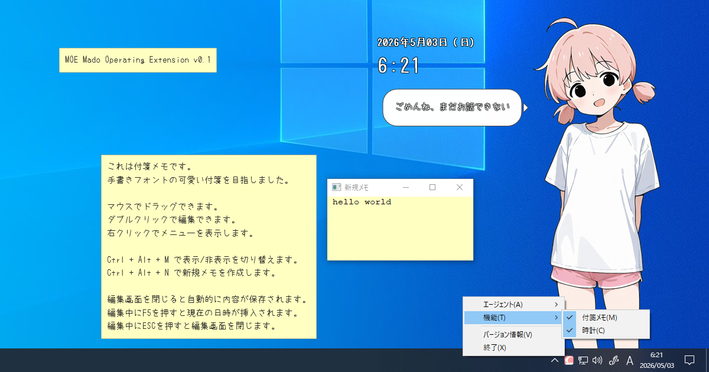

# MOE - Mado Operating Extension

Lightweight desktop mascot and utility app for Windows.
("Mado" means "Window" in Japanese)

## Features

- Native Windows app
- Written in C++17 / Win32
- Lightweight desktop mascot
- Sticky memo widget
- Clock widget
- No installer
- No registry usage

## Download

Download the latest release from:

https://github.com/imo-systems/moe/releases

## Installation

1. Download `moe-x.x.x.zip`
2. Extract the zip file
3. Run `moe.exe`

## Uninstallation

Delete the extracted folder.

MOE does not use the Windows registry.

## Requirements

- Windows 10 or later (64 bit)

## License

MIT License

## Author

IMO_SYSTEMS  
https://imosys.moe/

---

## 概要
MOE は付箋メモや時計ウィジェットを備えた、Windows用の常駐アプリケーションです。 
可愛いエージェントがお手伝いをしてくれます（予定）。 
過度な期待はあなたを落胆させるでしょう。

マスコットはPNG画像を用意する事で自由に追加できる予定です。
仕様は準備中です。
.rom は独自の難読化パッケージファイルです。
