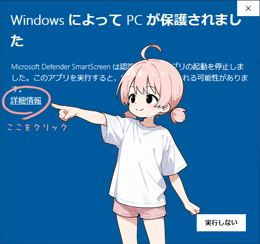
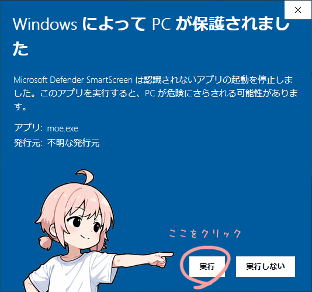

# MOE - Mado Operating Extension

Lightweight desktop mascot and utility app for Windows.
("Mado" means "Window" in Japanese)

## Features

- Native Windows app
- Written in C++17 / Win32
- Lightweight desktop mascot
- Sticky memo widget
- Clock widget
- No installer
- No registry usage

## Download

Download the latest release from:

https://github.com/imo-systems/moe/releases

## Installation

1. Download `moe-x.x.x.zip`
2. Extract the zip file
3. Run `moe.exe`

## Uninstallation

Delete the extracted folder.

MOE does not use the Windows registry.

## Requirements

- Windows 10 or later (64 bit)

## License

MIT License

## Author

IMO_SYSTEMS  
https://imosys.moe/

---

## 概要
* 『MOE』はWindows用のデスクトップマスコットです。PNG画像１枚で自由にキャラクターを追加できます。
* マスコットのほか、付箋メモや時計ウィジェットを備えています。
* 軽量な『MOE』はEXE単独で実行可能。レジストリは使用せず、ユーザーのPC環境を汚しません。 

## SmartScreenによる保護および対処
Microsoft Defender SmartScreen はコンピュータを保護する重要な仕組みです。
配布元および内容をご確認のうえ、ご自身の判断で実行してください。
不安がある場合は実行をお控えください。

