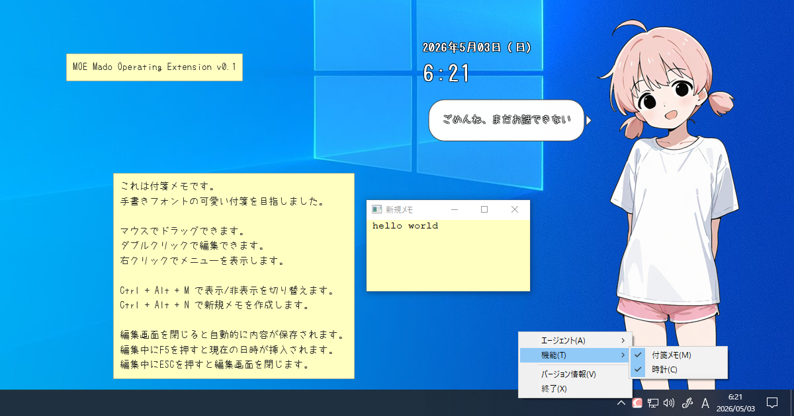

# MOE - Mado Operating Extension

## 特徴

- Windows 用の軽量なデスクトップマスコット
- インストール不要
- レジストリ不使用

## ダウンロード

https://github.com/imo-systems/moe/releases

## 使用方法

- moe-x.x.x.zip をダウンロード
- zip を任意のフォルダに解凍
- moe.exe を実行
- 不要になったらフォルダごと削除（レジストリは使用しません）

## 動作環境

Windows 10 or later (64 bit)

## 開発ポリシー

### Mado Operating Extension
ユーザーの作業を妨げないことを第一に考え、派手で目立つ機能はありません。
『MOE』はMado（窓=Windows）のUXをさりげなく拡張することを目的としています。

### Minimal Overhead Environment
アイドル時のCPU使用率は Under 1%
『MOE』はC++/Win32で開発された、軽量なWindowsネイティブアプリケーションです。リソース消費は可能な限り抑える設計を心がけています。

### Movable Offline Executable
インストール？アカウント？そんなものは必要ない。ただ実行するのみ。
『MOE』はZIP展開後すぐに実行可能なスタンドアロン設計のアプリケーションです。

## ライセンス

MIT License

## 著者

IMO_SYSTEMS  
https://imosys.moe/
